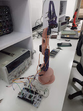
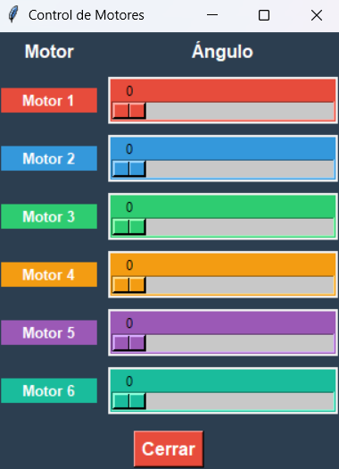

# 5-DOF Robotic Arm — STM32 & Python

A 5-degree-of-freedom robotic arm developed as a mechatronics and robotics project, combining embedded systems, forward kinematics, and computer-based control.

## Overview

This project focuses on the design and control of a 5-DOF robotic arm capable of calculating and controlling its end-effector position using forward kinematics.

The system is divided into two main parts:

* **Embedded firmware:** Developed in C++ for an STM32F745 microcontroller.
* **Control and analysis software:** Developed in Python for communication, visualization, and robotic-arm control.

## Main Features

* 5 degrees of freedom
* Forward kinematics
* Joint position control
* Embedded firmware using C++
* STM32F745 microcontroller
* Python-based control and visualization
* Serial communication between the computer and the embedded system
* Modular architecture for future inverse-kinematics and trajectory-planning implementations

## Technologies

**Embedded**

* C++
* STM32F745
* STM32 development environment
* PWM / motor control
* Serial communication

**Software**

* Python
* Robotics mathematics
* Forward kinematics
* Data visualization

## Kinematics

The forward kinematics model calculates the position and orientation of the robot's end effector based on the current joint angles.

The robot can be modeled using the Denavit-Hartenberg convention, allowing the transformation between consecutive joints to be calculated and combined into the final transformation matrix.

## Project Architecture

```text
                 ┌─────────────────────┐
                 │      Python App      │
                 │ Control / Interface │
                 └──────────┬──────────┘
                            │
                     Serial Communication
                            │
                            ▼
                 ┌─────────────────────┐
                 │      STM32F745      │
                 │   C++ Firmware      │
                 └──────────┬──────────┘
                            │
                            ▼
                 ┌─────────────────────┐
                 │    5-DOF Robot      │
                 │   Motors / Joints   │
                 └─────────────────────┘
```

## Goals

The main goal of the project is to integrate mechanical design, robotic kinematics, embedded programming, and high-level software into a single robotic system.

Future improvements may include inverse kinematics, trajectory planning, real-time visualization, and autonomous motion control.




